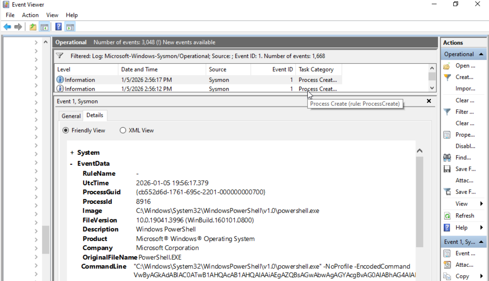

# IR-002: Suspicious PowerShell Execution (Sysmon EID 1)

## Summary
On 5 January 2026, Sysmon recorded PowerShell execution using an encoded command. Encoded PowerShell is commonly associated with obfuscation and is frequently investigated in SOC environments.

## Environment
- Lab: VirtualBox Windows 10 endpoint
- Telemetry: Sysmon (Microsoft-Windows-Sysmon/Operational)

## Detection / Evidence
- Data source: Sysmon Operational Log
- Event ID: 1 (Process Create)
- Timestamp: 5 January 2026 2:56:17 PM (local time)
- Key evidence:
  - Image: `C:\Windows\System32\WindowsPowerShell\v1.0\powershell.exe`
  - CommandLine: contains `-NoProfile` and `-EncodedCommand`
 

## Triage Actions Taken
- Filtered Sysmon log to Event ID 1 and searched for `powershell.exe`
- Reviewed command line for indicators of obfuscation (`-EncodedCommand`)
- Confirmed the encoded content was lab-safe and produced expected benign output

## Assessment
- Likely cause: simulated suspicious PowerShell execution in a controlled lab environment.
- Impact: No malicious payload observed in this lab scenario.

## Recommended Remediation
- Alert on PowerShell with `-EncodedCommand` / `-enc` and investigate parent process + user context.
- Enable strong PowerShell logging in enterprise environments and monitor for suspicious script patterns.
- Use allowlisting/least privilege controls to reduce abuse of scripting tools.

## Screenshots
- docs/06-sysmon-powershell-encodedcommand.png

